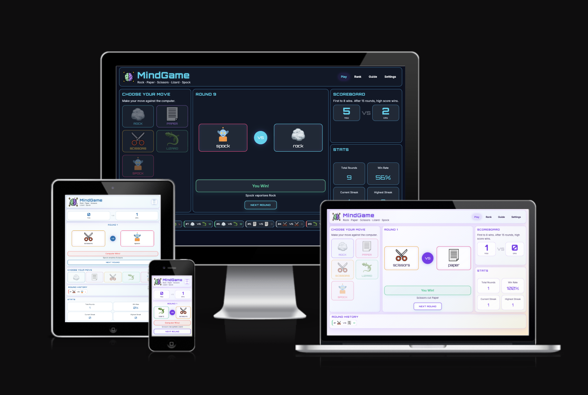
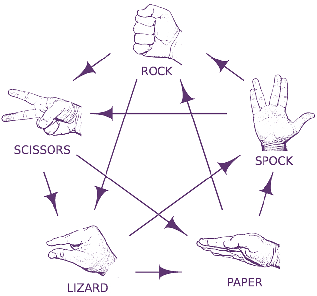
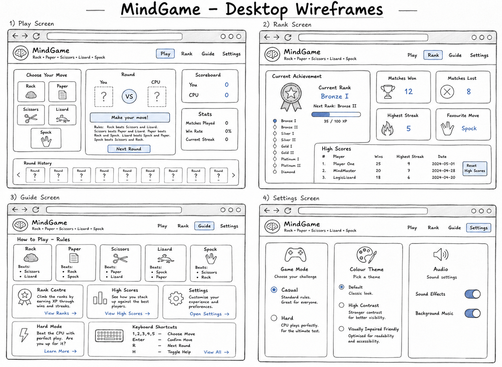
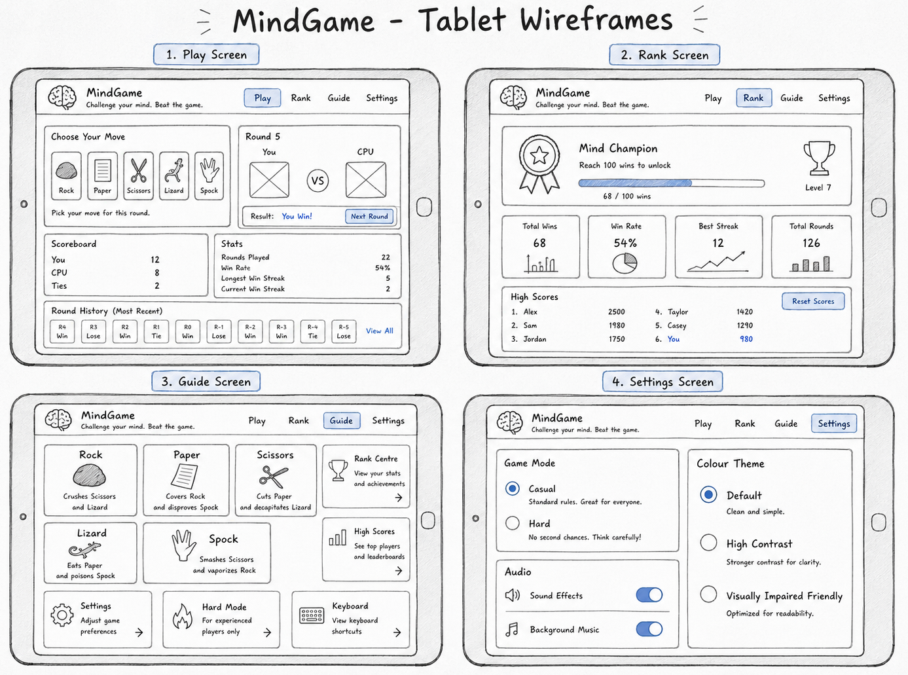
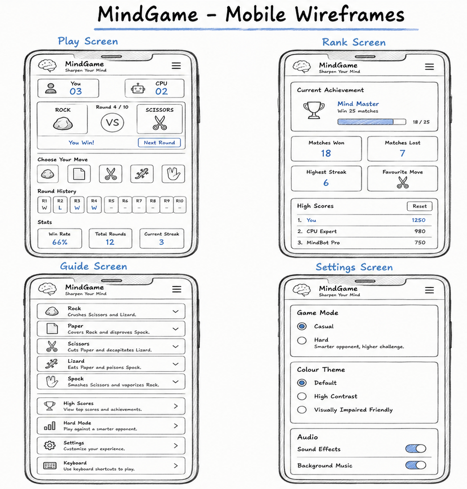
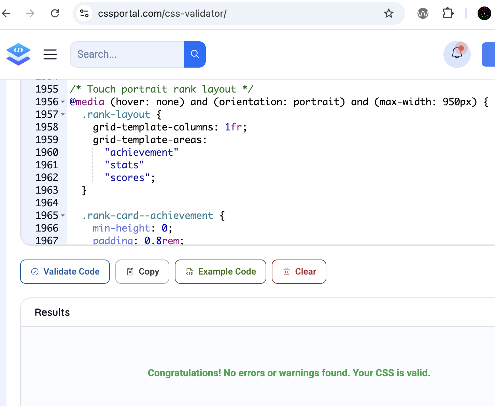

# MindGame: Rock Paper Scissors Lizard Spock

<p align="center">
  
</p>

[View Live Website](https://k2m13.github.io/milestone-project-2/)

MindGame responsive design shown across desktop, laptop, tablet and mobile screen sizes.

MindGame is a browser-based implementation of Rock, Paper, Scissors, Lizard, Spock, developed as part of the Code Institute Level 5 Diploma in Web Application Development. The project combines strategic gameplay, modern web technologies, and a futuristic user interface inspired by glassmorphism and science-fiction aesthetics.
The application allows players to compete against a computer opponent while tracking scores, analysing gameplay patterns, and developing winning strategies.

## Table of Contents

- [About](#about)
- [Key Features](#key-features)
- [Game Concept and Rules](#game-concept-and-rules)
- [User Experience UX](#user-experience-ux)
  - [Strategy Plane](#strategy-plane)
  - [Scope Plane](#scope-plane)
  - [Structure Plane](#structure-plane)
  - [Skeleton Plane](#skeleton-plane)
  - [Surface Plane](#surface-plane)
- [Wireframes](#wireframes)
- [Features](#features)
  - [Existing Features](#existing-features)
  - [Future Features](#future-features)
- [Technologies Used](#technologies-used)
- [Code Quality and Interesting Solutions](#code-quality-and-interesting-solutions)
- [Accessibility](#accessibility)
- [Testing](#testing)
  - [Testing Approach](#testing-approach)
  - [Manual Testing](#manual-testing)
  - [Responsive Testing](#responsive-testing)
  - [Browser Testing](#browser-testing)
  - [Accessibility Testing](#accessibility-testing)
  - [Validator Testing](#validator-testing)
  - [Automated Testing](#automated-testing)
  - [Bugs Found and Fixed](#bugs-found-and-fixed)
  - [Unfixed Bugs](#unfixed-bugs)
- [Deployment](#deployment)
  - [GitHub Pages Deployment](#github-pages-deployment)
  - [Local Development](#local-development)
- [Credits](#credits)
  - [Content](#content)
  - [Media](#media)
  - [Code](#code)
  - [Tools](#tools)
- [Acknowledgements](#acknowledgements)
- [Licence](#licence)

## About

MindGame is an interactive browser-based implementation of Rock Paper Scissors Lizard Spock, developed as part of the Code Institute Level 5 Diploma in Web Application Development. The game is designed for players who want a quick, strategic and accessible challenge that is more varied than traditional Rock Paper Scissors.

Players choose between five moves: Rock, Paper, Scissors, Lizard and Spock. Each move defeats two other moves and loses to two other moves. The first player to reach 8 wins takes the match. If neither player reaches 8 wins after 15 rounds, the player with the highest score wins.

The project includes two game modes. Casual Mode gives the computer a random move each round, while Hard Mode analyses the player's most frequently selected move and attempts to counter it. This gives players a choice between relaxed gameplay and a more strategic challenge.

MindGame also includes live score tracking, round history, win-rate statistics, rank progression, high scores, keyboard shortcuts, sound effects, background music, colour themes and local storage.

## Key Features

- Rock Paper Scissors Lizard Spock gameplay
- Casual Mode and Hard Mode
- First-to-8 match system with 15-round maximum
- Live scoreboard, win rate, streak and round history
- Rank progression and high score storage
- Sound effects and background music controls
- Keyboard, mouse and touch support
- High contrast and colourblind-friendly themes
- Responsive layout for desktop, tablet and mobile
- Custom 404 page


## Game Concept and Rules

Rock, Paper, Scissors, Lizard, Spock is an extension of the traditional game of Rock, Paper, Scissors, popularised by the television series The Big Bang Theory. Two additional hand signs are introduced: Lizard (represented by a hand puppet gesture) and Spock (represented by the Vulcan salute).

The game is played by two opponents who simultaneously choose one of the five available signs. The winner is determined according to a predefined set of interactions. If both opponents choose the same sign, the round results in a draw.

- Scissors cuts Paper
- Paper covers Rock
- Rock crushes Lizard
- Lizard poisons Spock
- Spock smashes Scissors
- Scissors decapitates Lizard
- Lizard eats Paper
- Paper disproves Spock
- Spock vaporizes Rock
- and Rock crushes Scissors

<p align="center">
  
</p>

## User Experience UX

The UX section describes the design process, planning, and the idea behind MindGame, taking into consideration user needs, accessibility and project goals.

### Strategy Plane

#### Project Goals

MindGame aims to create an engaging and visually appealing browser-based implementation of Rock, Paper, Scissors, Lizard, Spock. The project combines strategic gameplay with modern web design principles, including glassmorphism and futuristic user interface elements inspired by science fiction and cyberpunk aesthetics.

The primary goal is to provide users with an enjoyable gaming experience while showcasing the use of HTML, CSS, and JavaScript to create an interactive web application. The project also aims to encourage users to think strategically by presenting statistics, gameplay history, and behavioural insights based on their previous choices.

#### Player Goals

As a player I want to:

* Learn the rules of Rock, Paper, Scissors, Lizard, Spock quickly and easily.
* Play rounds against a computer opponent with minimal effort.
* Receive immediate visual feedback after each round.
* Track their score throughout a match.
* View previous rounds and gameplay history.
* Analyse their own playing patterns and favourite moves.
* Enjoy a responsive experience across desktop, tablet and mobile devices.
* Interact with a visually appealing and immersive game environment.

#### Developer Goals

The developer aims to:

* Demonstrate responsive web design using CSS.
* Demonstrate proficiency in HTML5 semantic structure.
* Implement game logic using modern JavaScript.
* Apply DOM manipulation techniques to create an interactive user experience.
* Develop reusable and maintainable code.
* Practise version control using Git and GitHub through regular incremental commits.
* Produce a professional portfolio project suitable for showcasing web development skills.

#### Business Goals

Although MindGame is an educational project, it has been designed as if it were a commercial browser game. Its business goals include:

* Encouraging users to spend time interacting with the application.
* Providing an intuitive and enjoyable user experience.
* Building user engagement through statistics and progression systems.
* Creating a distinctive visual identity that differentiates the game from traditional Rock, Paper, Scissors implementations.
* Demonstrating features that could support future expansion, such as player accounts, ranked matches, achievements, and adaptive AI opponents.


### Scope Plane

#### MoSCoW Prioritisation

The project requirements and planned features were prioritised using the MoSCoW framework to ensure that the core gameplay experience was delivered before additional enhancements.

#### User Stories
First-Time Visitor:
* As a first-time visitor, I want to understand the rules quickly so that I can start playing immediately.
* As a first-time visitor, I want the interface to be intuitive so that I do not need external instructions.
* As a first-time visitor, I want clear visual feedback after each round so that I understand why I won or lost.

Returning Player
* As a returning player, I want to play multiple rounds quickly so that the game remains engaging.
* As a returning player, I want to track my score so that I can measure my performance.
* As a returning player, I want to review previous rounds so that I can identify patterns in my gameplay.
* As a returning player, I want to see statistics about my choices so that I can improve my strategy.

Competitive Player
* As a competitive player, I want to achieve a high win rate so that I can demonstrate my skill.
* As a competitive player, I want to view progression and ranking information so that I feel rewarded for continued play.
* As a competitive player, I want the game to provide strategic insights so that I can make better decisions.

Site Owner
* As the site owner, I want users to enjoy the game so that they remain engaged with the application.
* As the site owner, I want the website to function correctly across different devices and browsers.
* As the site owner, I want the codebase to be maintainable and scalable so that additional features can be implemented in future releases.

#### Must Have

These features are essential for the application to function as a playable game:

* Responsive user interface.
* Navigation menu.
* Rock, Paper, Scissors, Lizard, Spock game logic.
* Computer-generated opponent choices.
* Win, lose, and draw determination.
* Round result display.
* Player and computer score tracking.
* Reset game functionality.
* Rules and instructions section.
* Casual mode: computer chooses a random move.

#### Should Have

These features significantly improve the user experience but are not essential for the game to function:

* Match history panel.
* Round counter.
* Statistics dashboard.
* Win percentage calculations.
* Visual animations and transitions.
* Enhanced accessibility features.
* Hard mode: computer analyses the player’s previous moves and tries to counter the most frequent one.
    - 1. Look at player's previous moves.
    - 2. Find the move the player uses most often.
    - 3. Computer chooses a move that beats that move.
    - 4. If there is no history yet, computer chooses randomly.

#### Could Have

These features would provide additional engagement and replay value if time permits:

* Rank progression system.
* Player profile customisation.
* Behavioural analysis of player choices.
* AI-generated strategic recommendations.
* Sound effects and background music.
* Achievement and badge system.
* Adaptive difficulty or 'AI confidence' messages.

#### Won't Have (Current Release)

The following features were considered but are outside the scope of the current project release:

* Online multiplayer gameplay.
* User registration and authentication.
* Cloud-based data storage.
* Global leaderboards.
* Real-time player matchmaking.
* Mobile application version.


>While the core project focuses on creating a polished and accessible implementation of Rock, Paper, Scissors, Lizard, Spock, the longer-term vision for MindGame is to evolve into a strategic browser game that analyses player behaviour and adapts to individual playing styles.

### Structure Plane

MindGame is structured as a single-page application with four main screens: Play, Rank, Guide and Settings. The navigation is consistent across the application so that users can move between gameplay, progress tracking, instructions and preferences without leaving the main experience.

The Play screen is the main interaction area. It prioritises the scoreboard, battle panel, move selection, round history and statistics. This allows players to make a move, understand the result and continue to the next round without needing to search for controls.

The Rank screen gives returning and competitive players a reason to continue playing by showing achievement progress, matches won and lost, highest streak, favourite move and saved high scores.

The Guide screen supports first-time users by explaining the rules, winning combinations and keyboard shortcuts. The Settings screen gives users control over game mode, colour theme, sound effects and background music.

### Skeleton Plane

The skeleton plane focused on arranging gameplay elements clearly across desktop, tablet and mobile layouts. The most important design decision was to keep the game flow visible and easy to follow: score, battle area, move selection, history and statistics.

On larger screens, the layout uses a dashboard-style arrangement so that the player can see multiple panels at the same time. On tablet and mobile screens, the layout stacks vertically to preserve readability and touch-friendly interaction.

#### Wireframes

Wireframes were created to plan the responsive layout of the game across desktop, tablet and mobile devices. They helped define the structure of the interface and the priority of key gameplay elements before the final visual styling was applied.

The final project evolved during development, especially after responsive testing on real and simulated devices. However, the wireframes remained useful for showing the intended layout logic and how the interface should adapt across screen sizes.

##### Desktop Wireframe

The desktop wireframe uses a spacious dashboard layout. It allows the player to view the move selection panel, battle area, scoreboard, statistics and round history at the same time.



##### Tablet Wireframe

The tablet wireframe adapts the interface for medium-sized screens. It preserves the main gameplay flow while reducing horizontal complexity and keeping controls large enough for touch interaction.



##### Mobile Wireframe

The mobile wireframe prioritises vertical stacking and touch-friendly controls. The scoreboard, battle panel, move choices, round history and statistics are arranged in a compact order to support smaller screens.



### Surface Plane

The final visual design uses a futuristic glassmorphism style with soft panels, rounded corners, neon-inspired accent colours and Orbitron headings. This gives the game a distinctive science-fiction identity while keeping the content readable.

The project includes a default theme, a high contrast theme and a colourblind-friendly theme. These options support accessibility and allow players to customise the visual experience. Typography, spacing, icons and responsive layout rules were refined throughout testing to keep the interface clear across desktop, tablet and mobile screens.


## Features

### Existing Features

- Play screen with move selection, scoreboard, battle panel, statistics and round history.
- Casual Mode with random computer moves.
- Hard Mode that analyses the player's most frequent move and chooses a counter move.
- First-to-8 match system with a 15-round maximum.
- Rank screen with achievement progress, match statistics, favourite move and high scores.
- Guide screen explaining rules, move relationships and keyboard shortcuts.
- Settings screen for difficulty, colour theme, sound effects and background music.
- Local storage for rank progress, high scores and selected settings.
- Custom 404 page with a clear route back to the homepage.

### Future Features

- Online multiplayer.
- Global leaderboard.
- Additional difficulty levels.
- More advanced adaptive computer opponent.
- Player profile customisation.
- Additional animations and sound settings.

## Technologies Used

### HTML5

HTML5 was used to create the structure and content of the MindGame application. The page is organised using semantic elements such as `header`, `main`, `section`, `nav`, `article`, `button`, `label`, `input`, `ol` and `ul`.
The project uses a single-page application structure, with separate screen sections for Play, Rank, Guide and Settings. Navigation links point to these sections using hash links, while JavaScript controls which screen is currently visible.
Interactive game choices are built with real `button` elements rather than clickable images or generic `div` elements. This improves accessibility, keyboard support and semantic meaning. Form controls are also used in the Settings screen for difficulty, 
colour theme, sound effects and background music. The HTML was structured to support responsive design. The same content is rearranged with CSS Grid and media queries for desktop, tablet and mobile layouts.

### Modern CSS Features Used

The project uses modern responsive CSS techniques. Layouts are built with CSS Grid using fractional (fr) units. 
Typography and icons use ```clamp()``` 
to create fluid scaling between minimum and maximum sizes. 
Relative units (rem) are used for spacing and sizing to improve accessibility 
and maintain consistent proportions across different screen sizes.

Empty move labels are hidden using the :empty pseudo-class, allowing the placeholder icon 
to remain perfectly centred until a move is selected.

### Interesting Solutions

When the expected visual change did not occur, browser developer tools and CSS inspection revealed that the issue 
was not in the JavaScript logic but in CSS specificity and property overriding. This reinforced 
the importance of debugging both behaviour and presentation separately.


## Code Quality and Interesting Solutions

### Variables

- `playerMove` — stores the move selected by the player.
- `computerMove` — stores the move randomly selected by the computer.
- `roundNumber` — tracks the current round.
- `playerScore` — tracks the player's score.
- `computerScore` — tracks the computer's score.
- `totalRounds` — tracks the number of completed rounds.
- `wins` — tracks player wins.
- `losses` — tracks player losses.
- `draws` — tracks drawn rounds.
- `currentStreak` — tracks consecutive player wins.

### Arrays

- `moveList` — stores the five possible moves: rock, paper, scissors, lizard, spock.
- `roundHistory` — stores previous round results.

### Objects

- `winningMoves` — stores which moves beat which other moves.
- `moveFrequency` — stores how often the player chooses each move.
- `ruleMessages` — stores the explanation for each winning combination.

### Functions

- `getComputerMove()` — randomly selects a computer move.
- `playRound(playerMove)` — runs one complete round.
- `determineWinner(playerMove, computerMove)` — compares both moves and returns win, lose, or draw.
- `updateScores(result)` — updates player and computer scores.
- `updateRoundStats(result)` — updates total rounds, wins, losses, draws, streak, and win rate.
- `updateMoveFrequency(playerMove)` — records how often the player uses each move.
- `displayChoices(playerMove, computerMove)` — displays both selected moves.
- `displayResult(result, playerMove, computerMove)` — displays the round result message.
- `addRoundToHistory(roundData)` — stores the round result in the history array.
- `renderHistory()` — displays round history on the page.
- `renderStats()` — updates total rounds, win rate, and current streak.
- `resetBattlePanel()` — resets the visible battle area.
- `resetGame()` — resets scores, rounds, history, and statistics.

### Event Listeners

- Navigation click listeners for Play, Rank, Rules, and Settings.
- Move button click listeners for Rock, Paper, Scissors, Lizard, and Spock.
- Optional keyboard listeners for accessibility:
  - `r` = Rock
  - `p` = Paper
  - `s` = Scissors
  - `l` = Lizard
  - `k` = Spock
  - `Escape` = return to Play or close overlays
  - Arrow keys or Tab for navigation support where appropriate.

### Game Loop

1. Player selects a move.
2. Computer randomly selects a move.
3. Both choices are displayed.
4. Winner is determined.
5. Scoreboard is updated.
6. Round history is updated.
7. Statistics are recalculated.
8. Round number increases.
9. Player can continue by choosing another move or reset the game.

### Score System

- Player gains 1 point for a win.
- Computer gains 1 point for a loss.
- No points are awarded for a draw.
- The game can be played until a set round limit, for example 15 rounds.

### History System

Each completed round should store:

- Round number.
- Player move.
- Computer move.
- Result.
- Rule explanation.

Example:

```javascript
{
  round: 1,
  playerMove: "rock",
  computerMove: "scissors",
  result: "win",
  rule: "Rock crushes Scissors"
}
```

### Statistics System

The statistics system should calculate:

- Total rounds played.
- Player win rate.
- Current winning streak.
- Most frequently selected move.
- Move frequency for each option.
- Win Condition

The game should check the `winningMoves` object.

```javascript
const winningMoves = {
  rock: ["scissors", "lizard"],
  paper: ["rock", "spock"],
  scissors: ["paper", "lizard"],
  lizard: ["spock", "paper"],
  spock: ["scissors", "rock"]
};
```

If `winningMoves[playerMove].includes(computerMove)` is true, the player wins.
If both moves are the same, the round is a draw. Otherwise, the computer wins.

### Rank

Players now progress:

0 wins      Beginner
5 wins      Competitor
10 wins     Veteran
25 wins     Grand Strategist
50 wins     Mind Master


### Custom 404 Page

Although MindGame is a single-page application with hash-based navigation, a custom 404 page has been included to improve the user experience when visitors enter an incorrect URL path, follow a broken link, or try to access a page that does not exist.
This supports a more complete and polished deployment on GitHub Pages.

https://k2m13.github.io/milestone-project-2/broken-link

### Accessibility

### HTML and ARIA Accessibility

Accessibility was considered throughout the HTML structure. Semantic HTML elements were used wherever possible so that the page has a clear document structure for users, browsers and assistive technologies.

The navigation is placed inside a `nav` element with an accessible label. The mobile hamburger menu uses `aria-label`, `aria-expanded` and `aria-controls` to describe what the button does, whether the menu is currently open, and which navigation element it controls.
The battle panel uses `aria-live="polite"` so that round feedback can be announced to assistive technology users when the result changes. `aria-atomic="true"` was added so that the updated battle feedback is treated as a complete message rather than disconnected fragments.
The audio controls use native checkbox inputs with `role="switch"` to communicate that they behave like on/off switches. Additional `aria-label` attributes were added so that screen readers can identify the Sound Effects and Background Music controls clearly.
Decorative icons use empty `alt=""` text where the surrounding text already provides the meaning. This avoids unnecessary repetition for screen reader users. Visual-only hamburger menu lines use `aria-hidden="true"` because the button itself already has an accessible label.

### Testing

### Testing Approach

Testing was carried out throughout the development of MindGame to check that the project worked correctly, remained usable across different devices, and met the needs of the intended users.
The project used both **manual testing** and **automated testing**. These two types of testing served different purposes.

### Manual Testing

Manual testing was used to test the full user experience of the application. This included checking layout, navigation, responsiveness, accessibility, visual feedback, game flow, audio controls and local storage behaviour.
Manual testing was important because MindGame is an interactive browser game. Some aspects of the project cannot be fully tested by automated code tests alone, such as whether the interface feels clear on mobile, whether buttons are easy to tap, whether the colour themes are readable, and whether the game gives understandable feedback after each round.
Manual testing focused on:

- Checking that the Play, Rank, Guide and Settings screens worked correctly.
- Checking that users could play a full match from start to finish.
- Checking that the scoreboard, round history and statistics updated correctly during gameplay.
- Checking that the layout adapted correctly on desktop, tablet and mobile screens.
- Checking that buttons, radio inputs, switches and navigation links were usable with mouse, touch and keyboard input.
- Checking that accessibility features such as semantic HTML, ARIA attributes, alt text and keyboard shortcuts worked as intended.
- Checking that local storage saved rank progress, high scores, favourite move data and settings correctly.
- Checking that the deployed GitHub Pages version matched the local development version.

### Manual Regression Testing

| Feature | Test | Expected Result | Pass/Fail |
|----------|----------|----------|----------|
| Navigation | Click Play, Rank, Rules and Settings tabs | Correct screen is displayed and active tab is highlighted | Pass |
| Next Round Button | Load page and click Next Round before choosing a move | Nothing happens | Pass |
| Round Flow | Select a move card | Computer move appears, result is displayed and move buttons become disabled | Pass |
| Next Round | Click Next Round after a completed round | Round number increases, battle panel resets and move buttons are re-enabled | Pass |
| Scoreboard | Win a round | Player score increases by 1 | Pass |
| Scoreboard | Lose a round | Computer score increases by 1 | Pass |
| Scoreboard | Draw a round | Neither score changes | Pass |
| Round History | Complete a round | Round result is added to the history panel | Pass |
| Total Rounds | Complete a round | Total rounds statistic increases by 1 | Pass |
| Win Rate | Win and lose multiple rounds | Win rate updates correctly | Pass |
| Current Streak | Win consecutive rounds | Streak increases correctly | Pass |
| Current Streak | Lose or draw a round | Streak resets to 0 | Pass |
| Match End | Reach 8 wins or complete 15 rounds with a higher score | Match winner message is displayed | Pass |
| Match End | Match finishes | Move buttons remain disabled | Pass |
| New Game | Click New Game after a completed match | Scores, stats, history and round number reset | Pass |
| New Game | Start a new game | Move buttons are enabled and game is playable again | Pass |
| Responsiveness | Test on mobile, tablet and desktop widths | Layout remains usable and readable | Pass |


### Validator Testing
#### HTML Validator

The HTML was tested to check that the page structure remained valid, readable and accessible across the application.

HTML testing included:

- Checking that all main screens were present and reachable: Play, Rank, Guide and Settings.
- Checking that navigation links opened the correct screen.
- Checking that all move buttons were real button elements and responded to mouse, touch and keyboard interaction.
- Checking that form controls in Settings could be selected and toggled.
- Checking that images had appropriate alt text: meaningful where needed and empty where decorative.
- Checking that ARIA attributes were used appropriately for the mobile menu, live battle feedback and switch-style audio controls.
- Checking that the document contained one main heading for the game title and clear section headings for each screen.
- Running the HTML through a validator and correcting any reported issues.
- Testing the structure on desktop, tablet and mobile screen sizes to ensure content remained readable and usable.

### HTML Validator


#### CSS Validator

| CSS Validation | CSS Portal validator | Passed | No errors or warnings found after fixing invalid `min-height: auto` values. |

<p align="left">
  
</p>

#### JavaScript Validator

JavaScript was checked using JSHint and Esprima. JSHint was configured for ES8 and browser-based JavaScript. Esprima confirmed that the script was syntactically valid.

| JavaScript Validation | JSHint and Esprima | Passed | JSHint showed no remaining warnings after ES8 configuration. Esprima confirmed that the code is syntactically valid. |


### Automated Testing

After the final JavaScript cleanup, the Jest test suite was run again and all 20 tests passed.
Automated testing was used to test the core JavaScript logic in a repeatable way. Jest tests were added for important game functions so that key parts of the game could be checked quickly after changes were made.
Automated testing was important because the game contains logic that must remain reliable, such as move validation, winner calculation, score updates, statistics and local storage behaviour. These areas are easier to test with predictable inputs and expected outputs.

Automated testing focused on:

- Checking that valid moves were recognised.
- Checking that draw rounds were identified correctly.
- Checking that winning and losing combinations returned the correct result.
- Checking that score and statistics functions behaved as expected.
- Checking that rank-related values and stored data could be tested without needing to play through the whole game manually.

The purpose of automated testing was to reduce the risk of regressions. When new features were added, such as Hard Mode, high scores, settings, sound controls and responsive layout changes, automated tests helped confirm that the underlying game logic still worked correctly.

### Automated testing with Jest

Automated testing was implemented using Jest. Core game logic, DOM manipulation, and statistics calculations were tested independently.
I prioritised testing the core game logic, statistics calculations and DOM updates because these are the most important functions and 
the most likely to affect gameplay if they fail.


### Why Both Testing Methods Were Needed

Manual and automated testing were both necessary because they tested different aspects of the project.
Automated testing helped confirm that the JavaScript logic produced the correct results. Manual testing confirmed that the complete application was usable, responsive, accessible and enjoyable to play.
Together, these testing methods provided stronger evidence that MindGame works as intended across its main features, devices and user interactions.

### Bugs Found and Fixed
### Unfixed Bugs


### 404

404 page tested by visiting an invalid deployed URL path and confirming that the custom 404 page loads, displays the themed astronaut illustration, 
and provides a working return-to-homepage button.

### Credits

Favicon from Magnific(https://www.magnific.com/icon/creativity_15557951#fromView=search&page=1&position=3&uuid=e59fb263-67ba-4c6e-9098-a6b2811f5241)


Background music: LumiaMusic18 - 'Starfall' https://www.newgrounds.com/audio/listen/1577123
Sounds: https://pixabay.com/sound-effects/search/victory/
Graphics: https://www.svgrepo.com/collection/universe-18/2

### Deployment

#### Deployment to Gitbub

### How to Run This Project Locally

### Acknowledgements

### Licence

MIT Licence

Copyright (c) [2026] [Kamil Sterniczuk, k2m13]

Permission is hereby granted, free of charge, to any person obtaining a copy
of this software and associated documentation files (the "Software"), to deal
in the Software without restriction, including without limitation the rights
to use, copy, modify, merge, publish, distribute, sublicense, and/or sell
copies of the Software, and to permit persons to whom the Software is
furnished to do so, subject to the following conditions:

The above copyright notice and this permission notice shall be included in all
copies or substantial portions of the Software.

THE SOFTWARE IS PROVIDED "AS IS", WITHOUT WARRANTY OF ANY KIND, EXPRESS OR
IMPLIED, INCLUDING BUT NOT LIMITED TO THE WARRANTIES OF MERCHANTABILITY,
FITNESS FOR A PARTICULAR PURPOSE AND NONINFRINGEMENT. IN NO EVENT SHALL THE
AUTHORS OR COPYRIGHT HOLDERS BE LIABLE FOR ANY CLAIM, DAMAGES OR OTHER
LIABILITY, WHETHER IN AN ACTION OF CONTRACT, TORT OR OTHERWISE, ARISING FROM,
OUT OF OR IN CONNECTION WITH THE SOFTWARE OR THE USE OR OTHER DEALINGS IN THE
SOFTWARE.