# MindGame: Rock Paper Scissors Lizard Spock

<p align="center">
  
</p>

[View Live Website](https://k2m13.github.io/milestone-project-2/)

MindGame responsive design shown across desktop, laptop, tablet and mobile screen sizes.

## Table of Contents

- [About](#about)
- [Key Features](#key-features)
- [Game Concept and Rules](#game-concept-and-rules)
- [User Experience UX](#user-experience-ux)
  - [Strategy Plane](#strategy-plane)
  - [Scope Plane](#scope-plane)
  - [Structure Plane](#structure-plane)
  - [Skeleton Plane](#skeleton-plane)
  - [Surface Plane](#surface-plane)
- [Wireframes](#wireframes)
- [Features](#features)
  - [Existing Features](#existing-features)
  - [Future Features](#future-features)
- [Technologies Used](#technologies-used)
- [Code Quality and Interesting Solutions](#code-quality-and-interesting-solutions)
- [Development Cycle and Version Control](#development-cycle-and-version-control)
- [Accessibility](#accessibility)
- [Testing](#testing)
  - [Testing Approach](#testing-approach)
  - [Manual Testing](#manual-testing)
  - [Responsive Testing](#responsive-testing)
  - [Browser Testing](#browser-testing)
  - [Accessibility Testing](#accessibility-testing)
  - [Validator Testing](#validator-testing)
  - [Automated Testing](#automated-testing)
  - [Bugs Found and Fixed](#bugs-found-and-fixed)
  - [Unfixed Bugs](#unfixed-bugs)
- [Deployment](#deployment)
  - [GitHub Pages Deployment](#github-pages-deployment)
  - [Local Development](#local-development)
- [Credits](#credits)
  - [Content](#content)
  - [Media](#media)
  - [Code](#code)
  - [Tools](#tools)
- [Acknowledgements](#acknowledgements)
- [Licence](#licence)

## About

MindGame is an interactive browser-based implementation of Rock Paper Scissors Lizard Spock, developed as part of the Code Institute Level 5 Diploma in Web Application Development. The game is designed for players who want a quick, strategic and accessible challenge that is more varied than traditional Rock Paper Scissors.

Players choose between five moves: Rock, Paper, Scissors, Lizard and Spock. Each move defeats two other moves and loses to two other moves. The first player to reach 8 wins takes the match. If neither player reaches 8 wins after 15 rounds, the player with the highest score wins.

The project includes two game modes. Casual Mode gives the computer a random move each round, while Hard Mode analyses the player's most frequently selected move and attempts to counter it. This gives players a choice between relaxed gameplay and a more strategic challenge.

MindGame also includes live score tracking, round history, win-rate statistics, rank progression, high scores, keyboard shortcuts, sound effects, background music, colour themes and local storage.

## Key Features

- Rock Paper Scissors Lizard Spock gameplay
- Casual Mode and Hard Mode
- First-to-8 match system with 15-round maximum
- Live scoreboard, win rate, streak and round history
- Rank progression and high score storage
- Sound effects and background music controls
- Keyboard, mouse and touch support
- High contrast and colourblind-friendly themes
- Responsive layout for desktop, tablet and mobile
- Custom 404 page


## Game Concept and Rules

Rock, Paper, Scissors, Lizard, Spock is an extension of the traditional game of Rock, Paper, Scissors, popularised by the television series The Big Bang Theory. Two additional hand signs are introduced: Lizard (represented by a hand puppet gesture) and Spock (represented by the Vulcan salute).

The game is played by two opponents who simultaneously choose one of the five available signs. The winner is determined according to a predefined set of interactions. If both opponents choose the same sign, the round results in a draw.

- Scissors cuts Paper
- Paper covers Rock
- Rock crushes Lizard
- Lizard poisons Spock
- Spock smashes Scissors
- Scissors decapitates Lizard
- Lizard eats Paper
- Paper disproves Spock
- Spock vaporizes Rock
- and Rock crushes Scissors

<p align="center">
  
</p>

## User Experience UX

The UX section describes the design process, planning, and the idea behind MindGame, taking into consideration user needs, accessibility and project goals.

### Strategy Plane

#### Project Rationale and Target Audience

MindGame was developed to create a more strategic and replayable version of a familiar browser game. Traditional Rock Paper Scissors is simple and quick to understand, but it can become repetitive because there are only three possible choices. Rock Paper Scissors Lizard Spock adds two extra moves, creating more possible outcomes and giving the player a greater sense of strategy.
The project was designed for casual players who want a quick game, first-time visitors who need clear rules and feedback, and returning players who enjoy tracking progress over time. The game also targets users who may be playing on different devices, so the interface needed to work clearly across desktop, tablet and mobile screens.
The purpose of the project is to provide an accessible, responsive and interactive game that gives immediate feedback after each round, teaches the rules clearly, and encourages replay through statistics, rank progression, high scores and difficulty settings. These design decisions are directly connected to the user stories identified during the planning stage.


#### Project Goals

MindGame aims to create an engaging and visually appealing browser-based implementation of Rock, Paper, Scissors, Lizard, Spock. The project combines strategic gameplay with modern web design principles, including glassmorphism and futuristic user interface elements inspired by science fiction and cyberpunk aesthetics.

The primary goal is to provide users with an enjoyable gaming experience while showcasing the use of HTML, CSS, and JavaScript to create an interactive web application. The project also aims to encourage users to think strategically by presenting statistics, gameplay history, and behavioural insights based on their previous choices.

#### Player Goals

As a player I want to:

* Learn the rules of Rock, Paper, Scissors, Lizard, Spock quickly and easily.
* Play rounds against a computer opponent with minimal effort.
* Receive immediate visual feedback after each round.
* Track their score throughout a match.
* View previous rounds and gameplay history.
* Analyse their own playing patterns and favourite moves.
* Enjoy a responsive experience across desktop, tablet and mobile devices.
* Interact with a visually appealing and immersive game environment.

#### Developer Goals

The developer aims to:

* Demonstrate responsive web design using CSS.
* Demonstrate proficiency in HTML5 semantic structure.
* Implement game logic using modern JavaScript.
* Apply DOM manipulation techniques to create an interactive user experience.
* Develop reusable and maintainable code.
* Practise version control using Git and GitHub through regular incremental commits.
* Produce a professional portfolio project suitable for showcasing web development skills.

#### Business Goals

Although MindGame is an educational project, it has been designed as if it were a commercial browser game. Its business goals include:

* Encouraging users to spend time interacting with the application.
* Providing an intuitive and enjoyable user experience.
* Building user engagement through statistics and progression systems.
* Creating a distinctive visual identity that differentiates the game from traditional Rock, Paper, Scissors implementations.
* Demonstrating features that could support future expansion, such as player accounts, ranked matches, achievements, and adaptive AI opponents.


### Scope Plane

#### MoSCoW Prioritisation

The project requirements and planned features were prioritised using the MoSCoW framework to ensure that the core gameplay experience was delivered before additional enhancements.

#### User Stories
First-Time Visitor:
* As a first-time visitor, I want to understand the rules quickly so that I can start playing immediately.
* As a first-time visitor, I want the interface to be intuitive so that I do not need external instructions.
* As a first-time visitor, I want clear visual feedback after each round so that I understand why I won or lost.

Returning Player
* As a returning player, I want to play multiple rounds quickly so that the game remains engaging.
* As a returning player, I want to track my score so that I can measure my performance.
* As a returning player, I want to review previous rounds so that I can identify patterns in my gameplay.
* As a returning player, I want to see statistics about my choices so that I can improve my strategy.

Competitive Player
* As a competitive player, I want to achieve a high win rate so that I can demonstrate my skill.
* As a competitive player, I want to view progression and ranking information so that I feel rewarded for continued play.
* As a competitive player, I want the game to provide strategic insights so that I can make better decisions.

Site Owner
* As the site owner, I want users to enjoy the game so that they remain engaged with the application.
* As the site owner, I want the website to function correctly across different devices and browsers.
* As the site owner, I want the codebase to be maintainable and scalable so that additional features can be implemented in future releases.

#### User Story Alignment

The main project features were developed in response to the user stories identified during planning.

| User Need                         | Related User Story                                                                                                                       | Project Response                                                                                             |
| --------------------------------- | ---------------------------------------------------------------------------------------------------------------------------------------- | ------------------------------------------------------------------------------------------------------------ |
| Learn the game quickly            | As a first-time visitor, I want to understand the rules quickly so that I can start playing immediately                                  | Added a Guide screen, rule cards, move explanations and a rules diagram                                      |
| Start playing easily              | As a first-time visitor, I want the interface to be intuitive so that I do not need external instructions                                | Designed a clear Play screen with visible move cards, scoreboard and result feedback                         |
| Understand round outcomes         | As a first-time visitor, I want clear visual feedback after each round so that I understand why I won or lost                            | Added battle panel feedback, result messages, rule explanations, score updates and sound effects             |
| Track performance                 | As a returning player, I want to track my score so that I can measure my performance                                                     | Added scoreboard, total rounds, win rate, current streak and highest streak                                  |
| Review previous rounds            | As a returning player, I want to review previous rounds so that I can identify patterns in my gameplay                                   | Added a round history panel                                                                                  |
| Improve strategy                  | As a returning player, I want to see statistics about my choices so that I can improve my strategy                                       | Added favourite move tracking and rank statistics                                                            |
| Feel rewarded for replaying       | As a competitive player, I want to view progression and ranking information so that I feel rewarded for continued play                   | Added Rank Centre, achievement levels and high scores                                                        |
| Increase challenge                | As a competitive player, I want the game to provide strategic insights so that I can make better decisions                               | Added Hard Mode, where the computer analyses the player's most frequent move and counters it                 |
| Use the game on different devices | As the site owner, I want the website to function correctly across different devices and browsers                                        | Built a responsive layout and tested it across desktop, tablet and mobile screen sizes                       |
| Support future development        | As the site owner, I want the codebase to be maintainable and scalable so that additional features can be implemented in future releases | Organised files by type, used clear JavaScript sections, external CSS/JS files, comments and version control |


#### Must Have

These features are essential for the application to function as a playable game:

* Responsive user interface.
* Navigation menu.
* Rock, Paper, Scissors, Lizard, Spock game logic.
* Computer-generated opponent choices.
* Win, lose, and draw determination.
* Round result display.
* Player and computer score tracking.
* Reset game functionality.
* Rules and instructions section.
* Casual mode: computer chooses a random move.

#### Should Have

These features significantly improve the user experience but are not essential for the game to function:

* Match history panel.
* Round counter.
* Statistics dashboard.
* Win percentage calculations.
* Visual animations and transitions.
* Enhanced accessibility features.
* Hard mode: computer analyses the player’s previous moves and tries to counter the most frequent one.
    - 1. Look at player's previous moves.
    - 2. Find the move the player uses most often.
    - 3. Computer chooses a move that beats that move.
    - 4. If there is no history yet, computer chooses randomly.

#### Could Have

These features would provide additional engagement and replay value if time permits:

* Rank progression system.
* Player profile customisation.
* Behavioural analysis of player choices.
* AI-generated strategic recommendations.
* Sound effects and background music.
* Achievement and badge system.
* Adaptive difficulty or 'AI confidence' messages.

#### Won't Have (Current Release)

The following features were considered but are outside the scope of the current project release:

* Online multiplayer gameplay.
* User registration and authentication.
* Cloud-based data storage.
* Global leaderboards.
* Real-time player matchmaking.
* Mobile application version.


>While the core project focuses on creating a polished and accessible implementation of Rock, Paper, Scissors, Lizard, Spock, the longer-term vision for MindGame is to evolve into a strategic browser game that analyses player behaviour and adapts to individual playing styles.

### Structure Plane

MindGame is structured as a single-page application with four main screens: Play, Rank, Guide and Settings. The navigation is consistent across the application so that users can move between gameplay, progress tracking, instructions and preferences without leaving the main experience.
The Play screen is the main interaction area. It prioritises the scoreboard, battle panel, move selection, round history and statistics. This allows players to make a move, understand the result and continue to the next round without needing to search for controls.
The Rank screen gives returning and competitive players a reason to continue playing by showing achievement progress, matches won and lost, highest streak, favourite move and saved high scores.
The Guide screen supports first-time users by explaining the rules, winning combinations and keyboard shortcuts. The Settings screen gives users control over game mode, colour theme, sound effects and background music.

#### User Flow

The main user flow was designed to keep gameplay simple and direct.

1. The user lands on the Play screen.
2. The user selects a move using mouse, touch or keyboard input.
3. The game shows the player's move and briefly delays the computer reveal.
4. The computer move is displayed.
5. The result, rule explanation, score, statistics and round history are updated.
6. The user selects Next Round to continue.
7. When the match ends, the Next Round button changes to New Game.
8. Returning users can visit the Rank screen to view progress or the Settings screen to change difficulty, theme and audio preferences.

This flow was chosen so that first-time users can start playing immediately, while returning and competitive users can access deeper features such as rank progression, statistics and Hard Mode.

### Skeleton Plane

The skeleton plane focused on arranging gameplay elements clearly across desktop, tablet and mobile layouts. The most important design decision was to keep the game flow visible and easy to follow: score, battle area, move selection, history and statistics.

On larger screens, the layout uses a dashboard-style arrangement so that the player can see multiple panels at the same time. On tablet and mobile screens, the layout stacks vertically to preserve readability and touch-friendly interaction.

#### Wireframes

Wireframes were created to plan the responsive layout of the game across desktop, tablet and mobile devices. They helped define the structure of the interface and the priority of key gameplay elements before the final visual styling was applied.

The final project evolved during development, especially after responsive testing on real and simulated devices. However, the wireframes remained useful for showing the intended layout logic and how the interface should adapt across screen sizes.

##### Desktop Wireframe

The desktop wireframe uses a spacious dashboard layout. It allows the player to view the move selection panel, battle area, scoreboard, statistics and round history at the same time.


##### Tablet Wireframe

The tablet wireframe adapts the interface for medium-sized screens. It preserves the main gameplay flow while reducing horizontal complexity and keeping controls large enough for touch interaction.


##### Mobile Wireframe

The mobile wireframe prioritises vertical stacking and touch-friendly controls. The scoreboard, battle panel, move choices, round history and statistics are arranged in a compact order to support smaller screens.


### Surface Plane

The final visual design uses a futuristic glassmorphism style with soft panels, rounded corners, neon-inspired accent colours and Orbitron headings. This gives the game a distinctive science-fiction identity while keeping the content readable.
The project includes a default theme, a high contrast theme and a colourblind-friendly theme. These options support accessibility and allow players to customise the visual experience. Typography, spacing, icons and responsive layout rules were refined throughout testing to keep the interface clear across desktop, tablet and mobile screens.

#### Colour Palette and Typography

The visual design uses a futuristic palette with neon-inspired accent colours, soft panel backgrounds and strong contrast between text and interface elements. The default theme was designed to feel bright and game-like, while the high contrast and visually impaired friendly themes provide alternatives for users who need clearer separation between content and background.
The project uses two main typefaces. Orbitron is used for headings and game-style interface elements to support the science-fiction theme. Inter is used for body text and supporting information because it is clean, readable and suitable for longer interface text.

#### Design Choices

The visual design was created to support the science-fiction theme of Rock Paper Scissors Lizard Spock while keeping the interface clear and usable. Glass-style panels, rounded corners, neon-inspired accents and space-themed icons were used to give the game a distinctive identity.
The interface uses strong visual hierarchy so that the most important gameplay elements are easy to find: move choices, battle feedback, score, round history and statistics. The Play screen was designed as a dashboard on larger screens and as a stacked layout on smaller screens.
Colour themes were added to give users more control over readability. The default theme supports the main visual identity, while the high contrast and visually impaired friendly themes provide alternatives for users who need stronger separation between text, panels and background.
Orbitron was used for headings and game-style interface elements because it matches the futuristic theme. Inter was used for body text because it is clean, readable and suitable for longer interface information.

## Features

The features in MindGame were developed to support the main user stories: helping first-time visitors understand the game quickly, allowing returning players to track progress, and giving competitive players a reason to replay through statistics, rank progression and higher difficulty.

### Existing Features

#### Play Screen

The Play screen is the main gameplay area. It gives the player access to move selection, the battle panel, scoreboard, statistics and round history from one screen. This supports first-time visitors by making the main action clear as soon as the page loads.

<p align="center">
  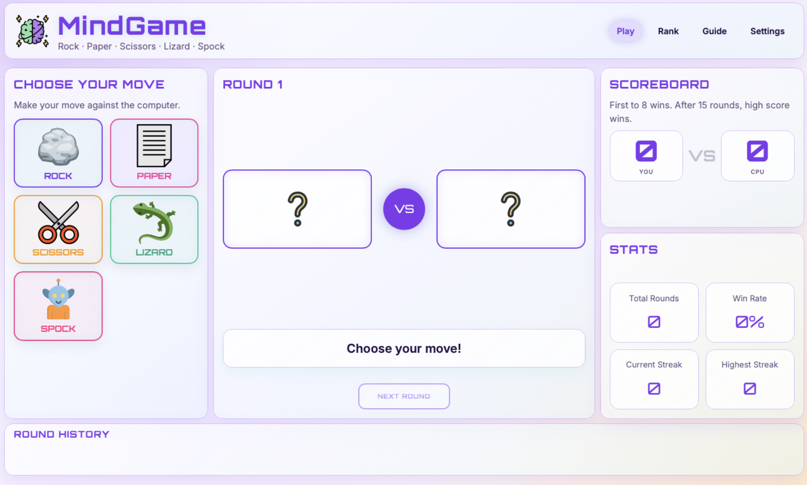
</p>

#### Round Feedback

After the player selects a move, the game displays the player's choice, the computer's choice, the round result and the rule explanation. The scoreboard and round history update immediately, helping the player understand why they won, lost or drew the round.

<p align="center">
  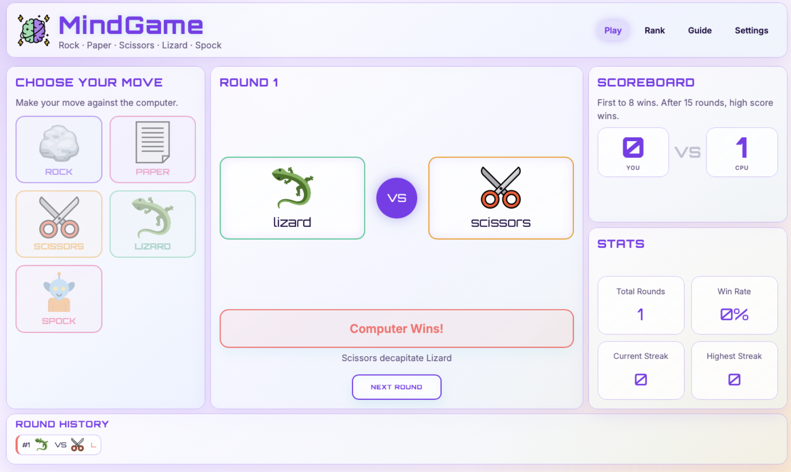
</p>

#### Match End and New Game Flow

A match ends when either the player or the computer reaches 8 wins, or when 15 rounds have been completed and one side has the higher score. When the match ends, the game displays the final result and changes the Next Round button into a New Game button so the user can restart clearly.

<p align="center">
  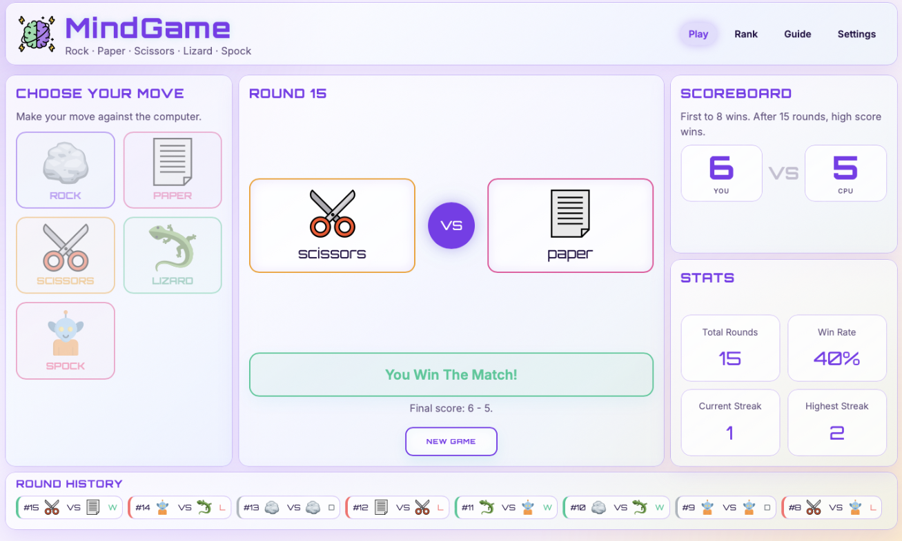
</p>

#### Guide Screen

The Guide screen explains the rules of Rock Paper Scissors Lizard Spock. Each move card shows which two moves it beats, helping first-time users learn the game without needing external instructions.

<p align="center">
  
</p>

#### Rank Centre and High Scores

The Rank screen supports returning and competitive players by saving long-term progress on the device. It displays achievement rank, matches won and lost, highest streak, favourite move and saved high scores.

<p align="center">
  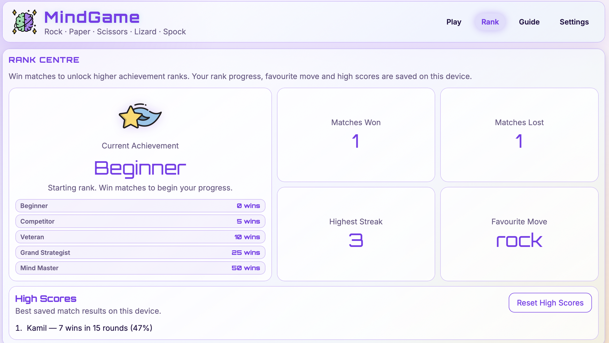
</p>

#### Settings and User Control

The Settings screen allows users to customise the game. Players can choose Casual Mode or Hard Mode, select a colour theme, toggle sound effects and switch background music on or off. Sound effects are enabled by default but only play after user interaction. Background music is disabled by default and must be switched on by the user.

<p align="center">
  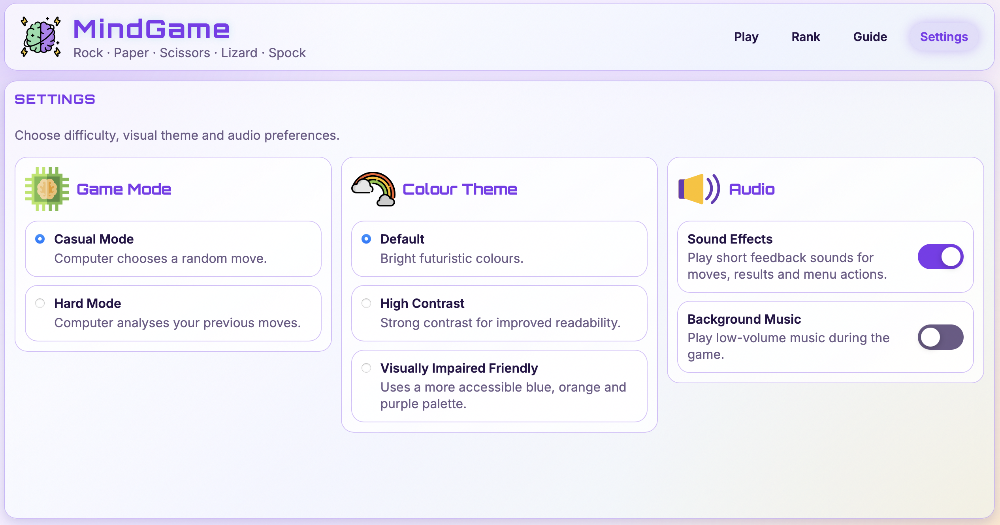
</p>

#### Responsive Mobile Layout

The mobile layout stacks the game panels vertically and keeps the buttons large enough for touch interaction. This supports users playing on smaller screens and helps prevent horizontal scrolling or cramped controls.

<p align="center">
  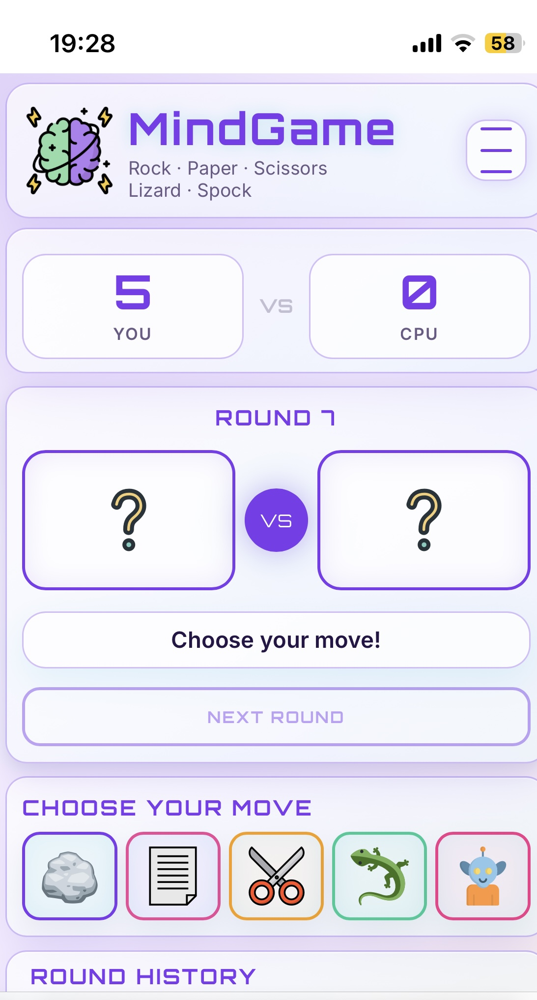
</p>

#### Responsive Tablet Layout

The tablet layout preserves the main gameplay flow while adapting the interface for portrait orientation. The scoreboard, battle panel, move selection, history and statistics remain readable and usable.

<p align="center">
  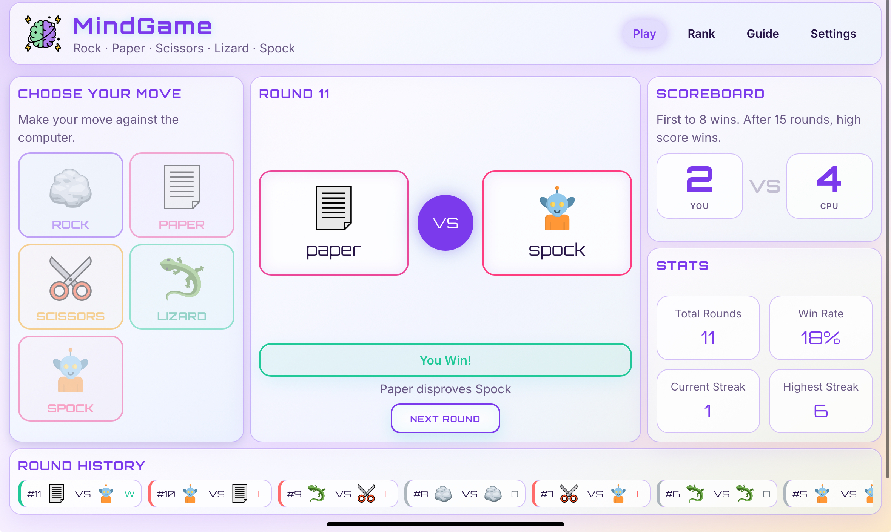
</p>

#### Casual Mode and Hard Mode

MindGame includes two difficulty options. Casual Mode gives the computer a random move each round. Hard Mode analyses the player's most frequently selected move and chooses a counter move, creating a more strategic challenge for competitive players.

#### Local Storage

Local storage is used to save rank progress, high scores, favourite move data and selected settings. This allows returning players to continue seeing their progress when they come back to the game on the same device.

#### Custom 404 Page

A custom 404 page was added so that users who visit an incorrect URL path still receive a styled MindGame page instead of a default browser or GitHub Pages error. The page matches the visual identity of the main project and includes a clear Return to Homepage button so users can recover easily.

<p align="center">
  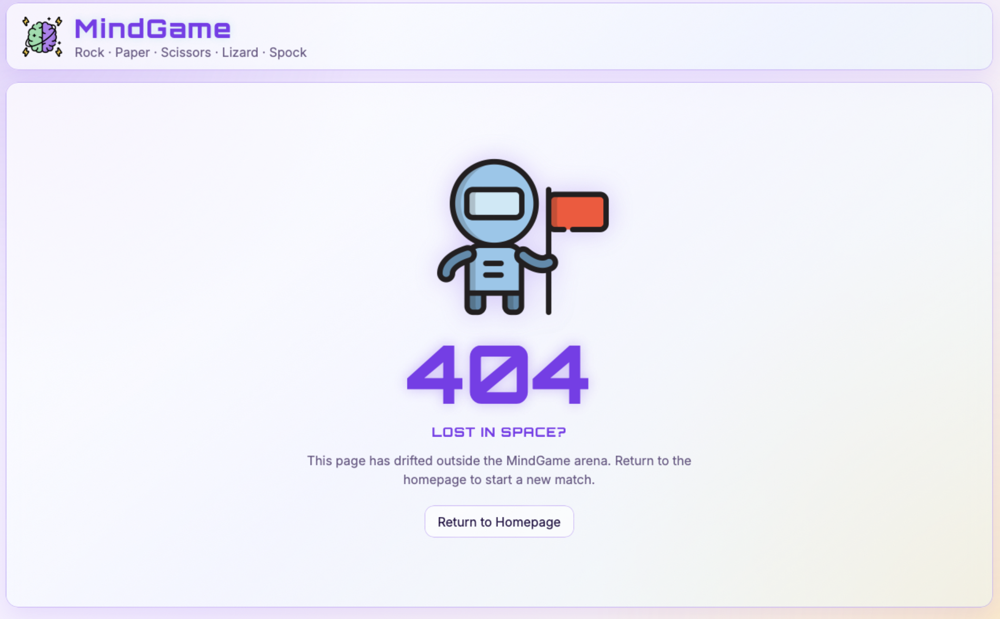
</p>

### Future Features

* Online multiplayer.
* Global leaderboard.
* Additional difficulty levels.
* More advanced adaptive computer opponent.
* Player profile customisation.
* Additional animations and sound settings.


## Technologies Used

### HTML5

HTML5 was used to create the structure and content of the MindGame application. The page is organised using semantic elements such as `header`, `main`, `section`, `nav`, `article`, `button`, `label`, `input`, `ol` and `ul`.
The project uses a single-page application structure, with separate screen sections for Play, Rank, Guide and Settings. Navigation links point to these sections using hash links, while JavaScript controls which screen is currently visible.
Interactive game choices are built with real `button` elements rather than clickable images or generic `div` elements. This improves accessibility, keyboard support and semantic meaning. Form controls are also used in the Settings screen for difficulty, 
colour theme, sound effects and background music. The HTML was structured to support responsive design. The same content is rearranged with CSS Grid and media queries for desktop, tablet and mobile layouts.

### Modern CSS Features Used

The project uses modern responsive CSS techniques. Layouts are built with CSS Grid using fractional (fr) units. 
Typography and icons use ```clamp()``` 
to create fluid scaling between minimum and maximum sizes. 
Relative units (rem) are used for spacing and sizing to improve accessibility 
and maintain consistent proportions across different screen sizes.

Empty move labels are hidden using the :empty pseudo-class, allowing the placeholder icon 
to remain perfectly centred until a move is selected.

### JavaScript

JavaScript was used to create the interactive behaviour of MindGame. It controls screen navigation, move selection, computer move generation, winner calculation, scoring, statistics, round history, rank progression, high scores, settings, audio controls and local storage.

### Jest

Jest was used for automated testing of core JavaScript logic, DOM updates and statistics calculations. This helped check that important functionality continued to work after changes were made.

### Git and GitHub

Git was used for version control throughout the project. GitHub was used to store the repository and track the development history through regular commits.

### GitHub Pages

GitHub Pages was used to deploy the live version of the project.

### Chrome DevTools

Chrome DevTools was used for debugging, responsive testing, layout inspection, console checks and localStorage testing.

### Validation Tools

The project was checked using the W3C Nu HTML Checker, CSS Portal, JSHint and Esprima.

## Code Quality and Interesting Solutions

### Interesting Solutions

When the expected visual change did not occur, browser developer tools and CSS inspection revealed that the issue 
was not in the JavaScript logic but in CSS specificity and property overriding. This reinforced 
the importance of debugging both behaviour and presentation separately.

### JavaScript Organisation

The main JavaScript file is organised with a table of contents and section comments so that related functionality is grouped together. This includes navigation, game state, local storage, sound effects, background music, computer move logic, winner logic, round flow, keyboard controls, scoring, history and theme settings.
Important functions include JSDoc comments explaining parameters, return values and purpose. This improves readability and makes the code easier to maintain or extend in future.
Additional helper files are used for automated Jest testing. These helper files allow core logic to be tested separately from the full browser interface.

### Empty and Invalid Input Handling

MindGame includes validation and defensive checks to handle empty or invalid data. Move selection is limited to the five valid game choices: Rock, Paper, Scissors, Lizard and Spock. If an invalid move value is received, the round does not continue and the user is prompted to choose a valid move.
The Next Round button is disabled until a valid round has been played, preventing the user from progressing through the game without making a move.
High-score name input is also handled defensively. If the user cancels the prompt, enters an empty value, or enters only spaces, the game uses a safe fallback name rather than saving empty data. Long names are shortened before being saved.
Local storage data is checked when high scores are loaded. If saved high-score data is missing, empty or invalid, the game resets the high-score list safely instead of causing a JavaScript error.

### Asynchronicity and Timing Control

MindGame uses asynchronous behaviour to improve the feel of gameplay. When a player selects a move, the game briefly delays the computer reveal so that the result does not appear instantly. This creates a clearer sense of round progression and makes the interaction feel more natural.
Timing control was important because several parts of the game can update at the end of a round: the computer move, result message, rule explanation, score, sound effects, round history and match-ending state. To prevent conflicting feedback, the game checks whether the match has ended before continuing with normal round feedback. This prevents round sounds or messages from overriding the final match result.
The game also uses defensive checks around stored data and user input. High-score data is loaded from local storage safely, and invalid or empty data is handled without breaking the application. This helps prevent timing or state problems when saved browser data is missing, corrupted or changed unexpectedly.

## Development Cycle and Version Control

The project was developed using Git and GitHub throughout the full development cycle. Regular commits were made for individual features, layout changes, bug fixes, validation improvements and README updates.

The development process included:

- Planning the game concept, user stories and MoSCoW priorities.
- Building the HTML structure for the Play, Rank, Guide and Settings screens.
- Styling the interface with responsive CSS and theme support.
- Implementing JavaScript game logic, scoring, statistics and local storage.
- Adding Casual Mode and Hard Mode.
- Adding sound effects, background music and user-controlled settings.
- Creating the Rank Centre, high scores and achievement progression.
- Testing and fixing gameplay logic, layout behaviour and validation issues.
- Adding automated Jest tests for core JavaScript logic.
- Refining responsive layouts for desktop, tablet and mobile.
- Creating a custom 404 page.
- Validating HTML, CSS and JavaScript.
- Deploying the project to GitHub Pages.
- Updating the README with UX, testing, accessibility, deployment and credits documentation.

Commit messages were written to describe each feature or fix clearly, providing evidence of the development process through the GitHub commit history.

<p align="left">
  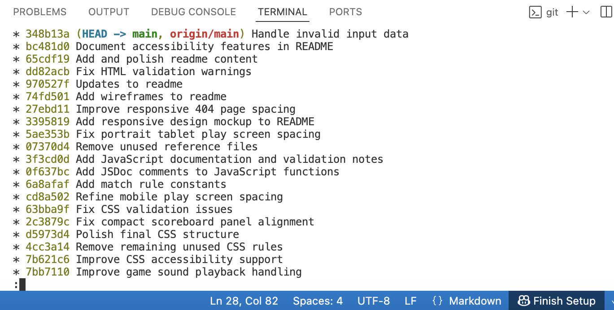
</p>

### Development Plan Completion

| Development Area | Completed |
|---|---|
| Plan game concept, target users and user stories | Yes |
| Create responsive wireframes | Yes |
| Build HTML structure for Play, Rank, Guide and Settings screens | Yes |
| Add responsive CSS layout and visual themes | Yes |
| Implement core JavaScript game logic | Yes |
| Add Casual Mode and Hard Mode | Yes |
| Add score, statistics, round history and rank progression | Yes |
| Add local storage for progress, high scores and settings | Yes |
| Add sound effects and user-controlled background music | Yes |
| Add keyboard shortcuts and accessibility improvements | Yes |
| Add custom 404 page | Yes |
| Validate HTML, CSS and JavaScript | Yes |
| Add automated Jest testing | Yes |
| Test local and deployed versions | Yes |
| Deploy to GitHub Pages | Yes |

## Accessibility

### HTML and ARIA Accessibility

Accessibility was considered throughout the HTML structure. Semantic HTML elements were used wherever possible so that the page has a clear document structure for users, browsers and assistive technologies.

The navigation is placed inside a `nav` element with an accessible label. The mobile hamburger menu uses `aria-label`, `aria-expanded` and `aria-controls` to describe what the button does, whether the menu is currently open, and which navigation element it controls.
The battle panel uses `aria-live="polite"` so that round feedback can be announced to assistive technology users when the result changes. `aria-atomic="true"` was added so that the updated battle feedback is treated as a complete message rather than disconnected fragments.
The audio controls use native checkbox inputs with `role="switch"` to communicate that they behave like on/off switches. Additional `aria-label` attributes were added so that screen readers can identify the Sound Effects and Background Music controls clearly.
Decorative icons use empty `alt=""` text where the surrounding text already provides the meaning. This avoids unnecessary repetition for screen reader users. Visual-only hamburger menu lines use `aria-hidden="true"` because the button itself already has an accessible label.

### Visual Accessibility and User Control

MindGame includes additional colour theme options to support different visual preferences and accessibility needs. In addition to the default theme, users can select a high contrast theme for stronger readability and a visually impaired friendly theme using a more accessible blue, orange and purple palette. These options can be changed from the Settings screen and are saved in local storage so that the selected theme remains active when the user returns to the game.

<p align="left">
  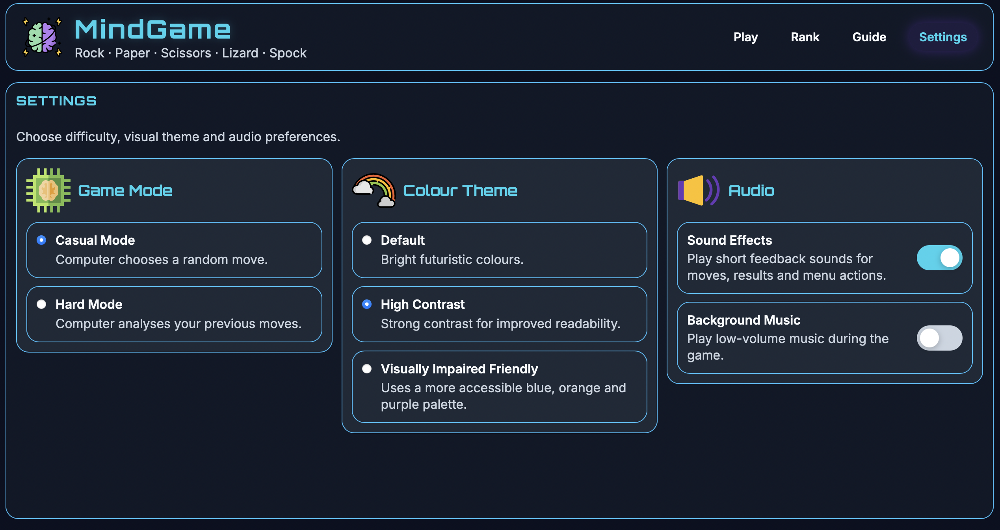
</p>

<p align="left">
  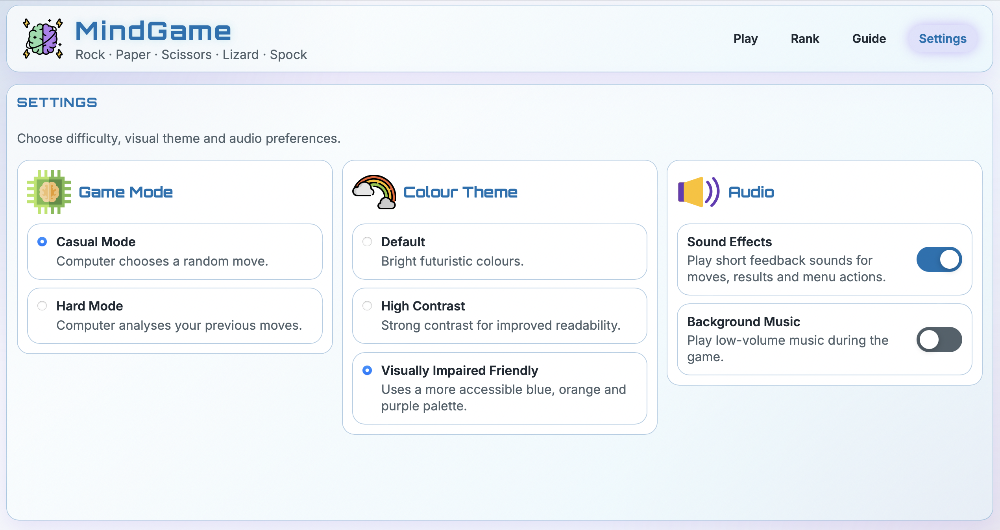
</p>

### Keyboard Navigation and SPA Structure

The application is built as a single-page application with separate Play, Rank, Guide and Settings screens. Users can move between these screens without loading a new page. Keyboard shortcuts were added to support faster navigation and gameplay on desktop or tablet devices with an external keyboard.

The main keyboard shortcuts are:

* `1–4` to switch between Play, Rank, Guide and Settings.
* `R`, `P`, `S`, `L` and `K` to choose Rock, Paper, Scissors, Lizard or Spock.
* `N` to move to the next round or start a new game after a match.
* `E` to toggle sound effects.
* `M` to toggle background music.
* `H` to reset high scores.
* `Escape` to close the mobile navigation menu.

<p align="left">
  
</p>

### Tooltips and Feedback

Interactive elements include helpful tooltip text using `title` attributes. These tooltips provide additional guidance for mouse users, such as identifying keyboard shortcuts for navigation links, move buttons and game controls. The game also provides immediate visual feedback after each round through the battle panel, result message, rule explanation, scoreboard and round history.

Sound effects are enabled by default but only play after user interaction. Background music is disabled by default and must be switched on by the user. This gives players control over audio playback and avoids unexpected background music when the page first loads.


### Auditory Feedback
Sound effects only play after user interaction, and background music is disabled by default so that users remain in control of audio playback.

## Testing

### Testing Approach

Testing was carried out throughout the development of MindGame to check that the project worked correctly, remained usable across different devices, and met the needs of the intended users.
The project used both **manual testing** and **automated testing**. These two types of testing served different purposes.

### Manual Testing

Manual testing was used to test the full user experience of the application. This included checking layout, navigation, responsiveness, accessibility, visual feedback, game flow, audio controls and local storage behaviour.
Manual testing was important because MindGame is an interactive browser game. Some aspects of the project cannot be fully tested by automated code tests alone, such as whether the interface feels clear on mobile, whether buttons are easy to tap, whether the colour themes are readable, and whether the game gives understandable feedback after each round.
Manual testing focused on:

- Checking that the Play, Rank, Guide and Settings screens worked correctly.
- Checking that users could play a full match from start to finish.
- Checking that the scoreboard, round history and statistics updated correctly during gameplay.
- Checking that the layout adapted correctly on desktop, tablet and mobile screens.
- Checking that buttons, radio inputs, switches and navigation links were usable with mouse, touch and keyboard input.
- Checking that accessibility features such as semantic HTML, ARIA attributes, alt text and keyboard shortcuts worked as intended.
- Checking that local storage saved rank progress, high scores, favourite move data and settings correctly.
- Checking that the deployed GitHub Pages version matched the local development version.

### Development and Deployed Version Testing

Testing was carried out throughout development and again after deployment to GitHub Pages. During development, features were tested locally after each major change or bug fix. This included testing game logic, navigation, layout behaviour, settings, local storage, accessibility features and responsive design.

After deployment, the live GitHub Pages version was tested again to confirm that it matched the local development version. The deployed site was checked for the same core functionality, layout, navigation, responsiveness and console behaviour.

| Test Area | Local Development Version | Deployed GitHub Pages Version | Result |
|---|---|---|---|
| Main navigation | Play, Rank, Guide and Settings screens opened correctly | Same behaviour confirmed on deployed site | Pass |
| Game flow | Player could select a move, view the CPU move, see the result and continue to the next round | Same behaviour confirmed on deployed site | Pass |
| Match ending | Match ended at 8 wins or after 15 rounds with the higher score winning | Same behaviour confirmed on deployed site | Pass |
| Rank and high scores | Rank progress, match statistics and high scores saved correctly in local storage | Same behaviour confirmed on deployed site | Pass |
| Settings | Game mode, colour theme, sound effects and background music controls worked correctly | Same behaviour confirmed on deployed site | Pass |
| Responsive layout | Layout worked across desktop, tablet and mobile screen sizes during development | Same layout confirmed using the deployed site | Pass |
| Custom 404 page | Invalid paths displayed the custom 404 page locally | Invalid deployed URL displayed the custom 404 page and return button | Pass |
| Console errors | No user action caused internal JavaScript console errors | No user action caused internal JavaScript console errors on the deployed site | Pass |

### Manual Regression Testing

The table below records the results of manual regression testing carried out on the final version of the project. Tests were chosen to cover functionality, usability, responsiveness, accessibility-related controls and the deployed user experience.

| Feature | Test | Expected Result | Pass/Fail |
|----------|----------|----------|----------|
| Navigation | Click Play, Rank, Rules and Settings tabs | Correct screen is displayed and active tab is highlighted | Pass |
| Next Round Button | Load page and click Next Round before choosing a move | Nothing happens | Pass |
| Round Flow | Select a move card | Computer move appears, result is displayed and move buttons become disabled | Pass |
| Next Round | Click Next Round after a completed round | Round number increases, battle panel resets and move buttons are re-enabled | Pass |
| Scoreboard | Win a round | Player score increases by 1 | Pass |
| Scoreboard | Lose a round | Computer score increases by 1 | Pass |
| Scoreboard | Draw a round | Neither score changes | Pass |
| Round History | Complete a round | Round result is added to the history panel | Pass |
| Total Rounds | Complete a round | Total rounds statistic increases by 1 | Pass |
| Win Rate | Win and lose multiple rounds | Win rate updates correctly | Pass |
| Current Streak | Win consecutive rounds | Streak increases correctly | Pass |
| Current Streak | Lose or draw a round | Streak resets to 0 | Pass |
| Match End | Reach 8 wins or complete 15 rounds with a higher score | Match winner message is displayed | Pass |
| Match End | Match finishes | Move buttons remain disabled | Pass |
| New Game | Click New Game after a completed match | Scores, stats, history and round number reset | Pass |
| New Game | Start a new game | Move buttons are enabled and game is playable again | Pass |
| Responsiveness | Test on mobile, tablet and desktop widths | Layout remains usable and readable | Pass |
| Invalid move value | Attempt to call the round function with an invalid move value | Game does not continue and user receives valid-move feedback | Pass |
| Empty high-score name | Cancel or submit an empty high-score prompt | Empty name is not saved and fallback handling is applied | Pass |
| Invalid local storage data | Corrupt the saved high-score data in localStorage and reload the page | Game loads safely and high scores reset without console errors | Pass |
| Custom 404 page | Visit an invalid deployed URL path | Styled 404 page loads and Return to Homepage button works | Pass |
| Asynchronous round feedback | Select a move and wait for the CPU reveal and result message | CPU move, rule explanation, score, history and sound feedback appear in the correct order without overriding the match result | Pass |


### Responsive Testing

Responsive testing was carried out using Chrome DevTools and the deployed GitHub Pages site. The layout was tested across desktop, laptop, tablet and mobile screen sizes to check that the interface remained readable, usable and free from horizontal overflow.

| Device / Viewport  | Orientation | Result                                                       |
| ------------------ | ----------- | ------------------------------------------------------------ |
| Desktop 1440 × 900 | Landscape   | Layout displayed correctly with all main panels visible      |
| Laptop 1280 × 800  | Landscape   | Layout remained readable and usable                          |
| Tablet 820 × 1180  | Portrait    | Layout stacked correctly after tablet spacing refinements    |
| Tablet 1024 × 768  | Landscape   | Layout remained balanced with no major empty spacing         |
| Mobile 390 × 844   | Portrait    | Layout stacked correctly and buttons remained touch-friendly |

### Real Device Testing

The deployed project was also checked on physical devices where available.

| Device | Browser | Result |
|---|---|---|
| MacBook Pro | Chrome | Passed |
| MacBook Pro | Safari | Passed |
| iPhone 13 mini | Safari | Passed |
| iPad Air | Safari | Passed |

### Accessibility Testing

Accessibility testing focused on semantic HTML, keyboard access, colour themes, visible feedback and user control over sound and music.

| Area Tested        | Result                                                                                     |
| ------------------ | ------------------------------------------------------------------------------------------ |
| Keyboard shortcuts | Move selection, navigation, sound, music and high-score reset shortcuts worked as expected |
| Colour themes      | Default, high contrast and visually impaired friendly themes could be selected and saved   |
| Audio controls     | Sound effects and background music could be controlled by the user                         |
| ARIA attributes    | Mobile navigation, live round feedback and switch controls were checked during validation  |
| Image alt text     | Decorative icons used empty alt text and meaningful images used descriptive alt text       |

### Validator Testing
#### HTML Validator

The HTML was tested to check that the page structure remained valid, readable and accessible across the application.

HTML testing included:

- Checking that all main screens were present and reachable: Play, Rank, Guide and Settings.
- Checking that navigation links opened the correct screen.
- Checking that all move buttons were real button elements and responded to mouse, touch and keyboard interaction.
- Checking that form controls in Settings could be selected and toggled.
- Checking that images had appropriate alt text: meaningful where needed and empty where decorative.
- Checking that ARIA attributes were used appropriately for the mobile menu, live battle feedback and switch-style audio controls.
- Checking that the document contained one main heading for the game title and clear section headings for each screen.
- Running the HTML through a validator and correcting any reported issues.
- Testing the structure on desktop, tablet and mobile screen sizes to ensure content remained readable and usable.

<p align="left">
  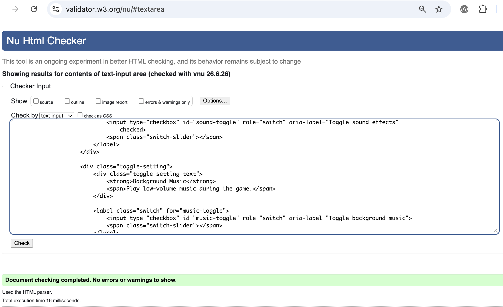
</p>

### Controls

MindGame can be played using mouse, touch or keyboard input.

- Mouse or touch: select a move card.
- `R` = Rock.
- `P` = Paper.
- `S` = Scissors.
- `L` = Lizard.
- `K` = Spock.
- `N` = Next Round or New Game.
- `1–4` = switch between Play, Rank, Guide and Settings.
- `E` = toggle sound effects.
- `M` = toggle background music.
- `H` = reset high scores.
- `Escape` = close the mobile navigation menu.


#### CSS Validator

| CSS Validation | CSS Portal validator | Passed | No errors or warnings found after fixing invalid `min-height: auto` values. |

<p align="left">
  
</p>

#### JavaScript Validator

JavaScript was checked using JSHint and Esprima. JSHint was configured for ES8 and browser-based JavaScript. Esprima confirmed that the script was syntactically valid.

| JavaScript Validation | JSHint and Esprima | Passed | JSHint showed no remaining warnings after ES8 configuration. Esprima confirmed that the code is syntactically valid. |

<p align="left">
  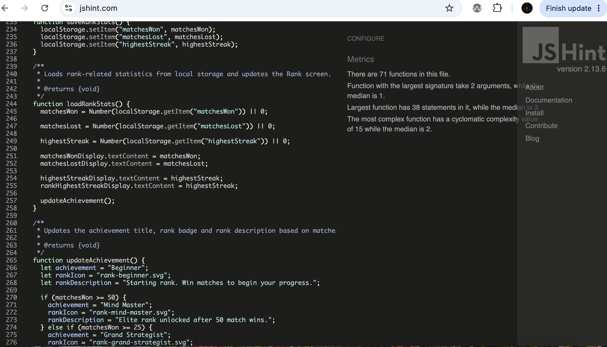
</p>

<p align="left">
  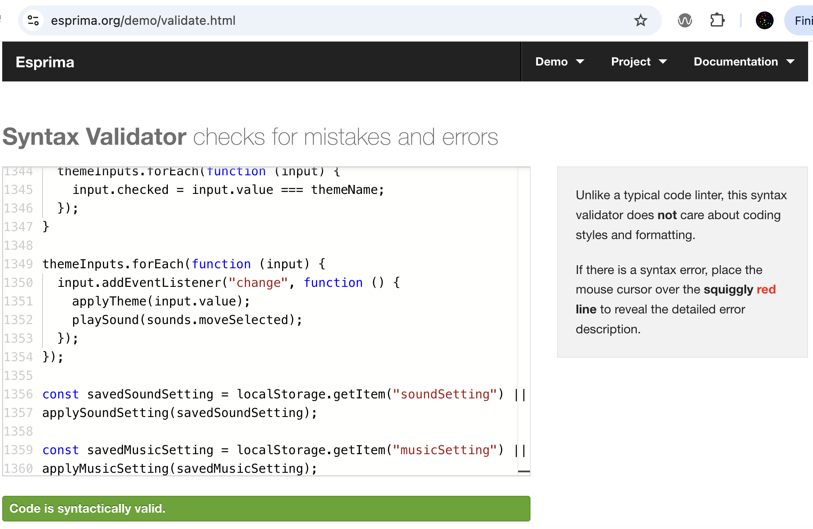
</p>

### Automated Testing

After the final JavaScript cleanup, the Jest test suite was run again and all 20 tests passed.
Automated testing was used to test the core JavaScript logic in a repeatable way. Jest tests were added for important game functions so that key parts of the game could be checked quickly after changes were made.
Automated testing was important because the game contains logic that must remain reliable, such as move validation, winner calculation, score updates, statistics and local storage behaviour. These areas are easier to test with predictable inputs and expected outputs.

Automated testing focused on:

- Checking that valid moves were recognised.
- Checking that draw rounds were identified correctly.
- Checking that winning and losing combinations returned the correct result.
- Checking that score and statistics functions behaved as expected.
- Checking that rank-related values and stored data could be tested without needing to play through the whole game manually.

The purpose of automated testing was to reduce the risk of regressions. When new features were added, such as Hard Mode, high scores, settings, sound controls and responsive layout changes, automated tests helped confirm that the underlying game logic still worked correctly.

### Automated testing with Jest

Automated testing was implemented using Jest. Core game logic, DOM manipulation, and statistics calculations were tested independently.
I prioritised testing the core game logic, statistics calculations and DOM updates because these are the most important functions and 
the most likely to affect gameplay if they fail.

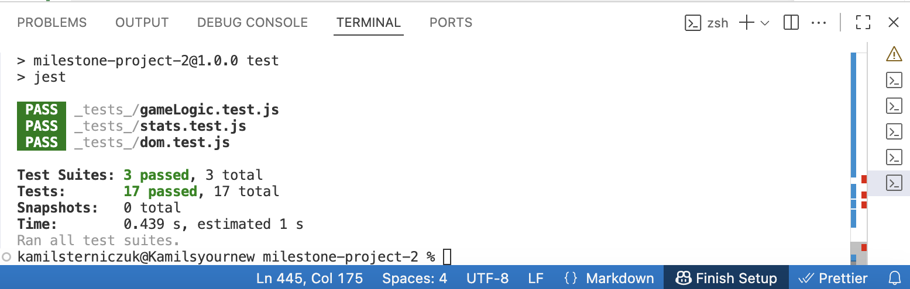

### Why Both Testing Methods Were Needed

Manual and automated testing were both necessary because they tested different aspects of the project.
Automated testing helped confirm that the JavaScript logic produced the correct results. Manual testing confirmed that the complete application was usable, responsive, accessible and enjoyable to play.
Together, these testing methods provided stronger evidence that MindGame works as intended across its main features, devices and user interactions.

### Bugs Found and Fixed

| Bug | Cause | Fix | Status |
|---|---|---|---|
| Match continued after the intended match limit | Match-ending state was not stopping further input reliably | Added match-end logic and disabled move buttons when the match finishes | Fixed |
| Final match feedback was sometimes replaced by round feedback | Round-end feedback could still run after the match had ended | Added checks to prevent round sounds and messages from overriding match-end feedback | Fixed |
| Scoreboard and stats panels were uneven on compact screens | Extra spacing affected the scoreboard panel in responsive layouts | Removed unnecessary spacing and refined compact layout rules | Fixed |
| CSS validation failed for `min-height: auto` | `auto` is not a valid value for `min-height` | Removed or replaced invalid CSS values | Fixed |
| Tablet portrait layout had excessive empty space | The Play screen layout did not suit portrait tablet dimensions | Added responsive layout rules for portrait tablet screens | Fixed |
| 404 page had excessive spacing on some devices | The 404 panel was centred inside the available screen height instead of stretching naturally | Updated the 404 container and panel layout | Fixed |
| HTML validation showed ARIA and section warnings | Some ARIA labels were used on generic `div` elements and some structural containers used `section` unnecessarily | Updated the HTML structure and ARIA roles so the document passed validation | Fixed |

### Unfixed Bugs

No known unfixed bugs remain at the time of submission.

## Deployment

### GitHub Pages Deployment

The project was deployed using GitHub Pages.

1. The project was created and version controlled using Git and GitHub.
2. The repository was pushed to GitHub.
3. In the GitHub repository, Settings was opened.
4. Pages was selected from the left-hand menu.
5. The `main` branch was selected as the deployment source.
6. The root folder was selected.
7. GitHub Pages built and published the project.

Live site: [MindGame](https://k2m13.github.io/milestone-project-2/)

### Local Development

To run the project locally:

1. Clone the repository:

   ```bash
   git clone https://github.com/k2m13/milestone-project-2.git
   ```

2. Open the project folder in VS Code.

3. Open `index.html` in a browser, or use a local development server.

4. To run automated tests, install dependencies:

   ```bash
   npm install
   ```

5. Run the Jest test suite:

   ```bash
   npm test
   ```

## Credits

### Content

### Content

- The Rock Paper Scissors Lizard Spock rules are based on the commonly known expanded version of Rock Paper Scissors.
- README structure was informed by Code Institute project requirements and example student README files, including Forest Pals, Echoes of the Crystal Cave and my previous Nokia E72 milestone project.
- All written explanations, feature descriptions, UX notes, testing notes and deployment documentation were written specifically for this project.

### Media

- Favicon: Magnific creativity icon. (https://www.magnific.com/icon/creativity_15557951#fromView=search&page=1&position=3&uuid=e59fb263-67ba-4c6e-9098-a6b2811f5241)
- Background music: [LumiaMusic18 - "Starfall"](https://www.newgrounds.com/audio/listen/1577123) from Newgrounds.
- Sound effects: Pixabay sound effects. https://pixabay.com/sound-effects/search/victory/
- Game graphics and icons: SVG Repo universe icon collection: https://www.svgrepo.com/collection/universe-18/2

### Code

- The project code was written by Kamil Sterniczuk.
- Jest was used for automated JavaScript testing.
- JSHint and Esprima were used for JavaScript validation.
- CSS Portal was used for CSS validation.
- W3C Nu HTML Checker was used for HTML validation.

### Tools

- Git and GitHub for version control.
- GitHub Pages for deployment.
- Chrome DevTools for responsive testing and debugging.
- VS Code for development.
- Balsamiq-style wireframes were used to support responsive layout planning.

## Acknowledgements

- Code Institute for the project brief and course material.
- My tutor for feedback during development.
- [Forest Pals](https://github.com/Carokyp/Forest-Pals) and [Echoes of the Crystal Cave](https://github.com/Seren-Hughes/crystal-cave) README files were used as structure and documentation references.

## Licence

MIT Licence

Copyright (c) [2026] [Kamil Sterniczuk, k2m13]

Permission is hereby granted, free of charge, to any person obtaining a copy
of this software and associated documentation files (the "Software"), to deal
in the Software without restriction, including without limitation the rights
to use, copy, modify, merge, publish, distribute, sublicense, and/or sell
copies of the Software, and to permit persons to whom the Software is
furnished to do so, subject to the following conditions:

The above copyright notice and this permission notice shall be included in all
copies or substantial portions of the Software.

THE SOFTWARE IS PROVIDED "AS IS", WITHOUT WARRANTY OF ANY KIND, EXPRESS OR
IMPLIED, INCLUDING BUT NOT LIMITED TO THE WARRANTIES OF MERCHANTABILITY,
FITNESS FOR A PARTICULAR PURPOSE AND NONINFRINGEMENT. IN NO EVENT SHALL THE
AUTHORS OR COPYRIGHT HOLDERS BE LIABLE FOR ANY CLAIM, DAMAGES OR OTHER
LIABILITY, WHETHER IN AN ACTION OF CONTRACT, TORT OR OTHERWISE, ARISING FROM,
OUT OF OR IN CONNECTION WITH THE SOFTWARE OR THE USE OR OTHER DEALINGS IN THE
SOFTWARE.